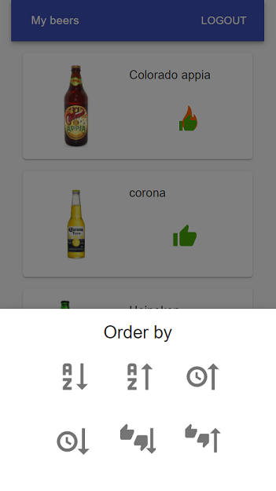
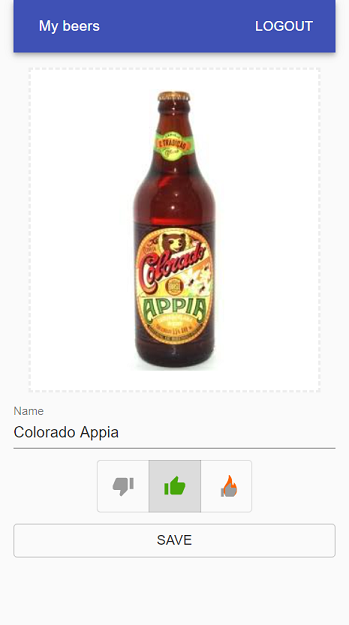

# my-beers

A simple app to save the beers you have tasted. It was developed as an exercise on the following technologies:

- [x] MERN stack with ❤️ Typescript ❤️
- [x] Monorepo using Lerna and Yarn Workspaces
- [x] Code sharing between packages
- [x] Eslint
- [ ] Tests with Jest
- [ ] Material-ui theming
- [x] Session based authentication with Passportjs
- [ ] Login with Google, and support for other oauth2 authorization providers
- [x] CDN-based media storage with a cloud service
- [x] Heroku hosting, featuring Continuous Delivery via automatic deploys with Heroku-Github integration
- [ ] React Native mobile app that consumes the same API and shares some logic with the Web App

## Features

- Login with your email or google account
- Save the beers you tasted and give them a like, dislike or MEGALike
- Sort trough your beers at any time to remember the ones you liked and the ones you disliked. Never wonder if you tasted a beer again




## api

To run the app locally, the following env variables need to be defined:

```
SESSION_COOKIE_SECRET
CLOUDINARY_API_SECRET
CLOUDINARY_API_URL
CLOUDINARY_API_KEY
```

To run in production, the following env variables need to be defined:

```
MONGO_USER
MONGO_PASSWORD
MONGO_SERVER_URL
NODE_ENV
SESSION_COOKIE_SECRET
CLOUDINARY_API_SECRET
CLOUDINARY_API_URL
CLOUDINARY_API_KEY
```
